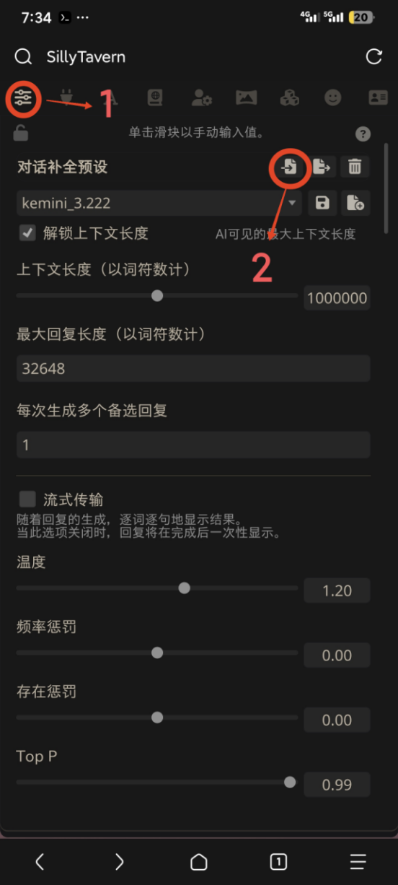
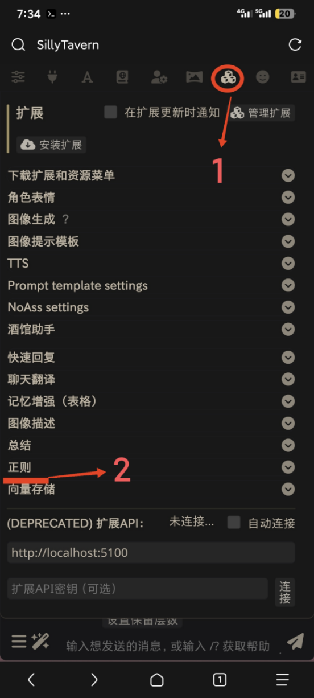

# 导入预设及正则

## 导入预设

1.  点击应用程序界面右上角的三条横杠图标，打开预设管理界面。

    

2.  在预设管理界面中，点击“导入预设”按钮。

    

3.  在弹出的文件选择对话框中，找到并选择您想要导入的预设文件。

    **注意：** 有些预设可能默认了特定的API连接作为聊天补全来源。如果您的需求不是使用预设的默认API（例如，您希望使用自定义的API设置），请在导入后检查并修改聊天补全来源为“自定义”。

## 导入正则

1.  完成预设导入后，点击界面上的三个骰子图标，进入正则管理界面。

2.  在正则管理界面，选择“导入正则”选项。

3.  选择与您刚刚导入的预设相对应的正则文件进行导入。

4.  导入成功后，请选择“保存为全局正则”选项，以确保该正则配置在所有聊天中生效。